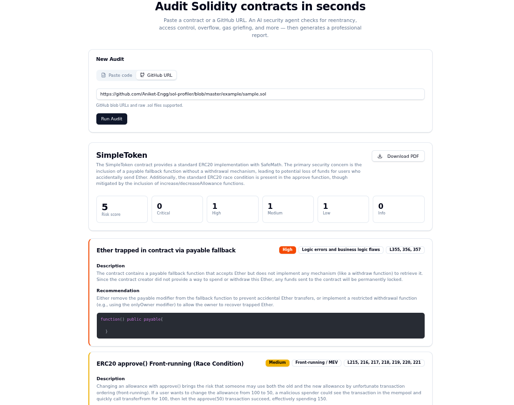

# AgentAudit 🛡️

### AI-powered Solidity smart contract security auditor — built with Google Gemini API

[](https://agentaudit.vercel.app)
[](https://ai.google.dev)
[](https://react.dev)
[](LICENSE)

---

## The problem

In 2024–2025, over **$2.3 billion** was lost to smart contract exploits. Small Web3 projects and indie developers cannot afford $10,000–$20,000 manual security audits. Vulnerabilities like reentrancy attacks, integer overflows, and ERC20 race conditions go undetected until it's too late.

**AgentAudit solves this.** Paste a Solidity contract or drop a GitHub URL — the Gemini AI agent scans it in seconds and returns a professional security report with severity-rated findings, line numbers, and actionable fix recommendations.

---

## Demo



**Sample audit output on a real ERC20 contract:**

```
SimpleToken — Risk Score: 5/100
✔ 3 findings detected

HIGH   → Ether trapped via payable fallback (L355–357)
MEDIUM → ERC20 approve() front-running / race condition (L215–221)
LOW    → Insufficient zero address check syntax (L306, 319)
```

---

## Features

- **Paste or link** — supports raw Solidity code or GitHub blob/raw URLs
- **Gemini-powered analysis** — checks for reentrancy, access control flaws, overflow, MEV/front-running, gas griefing, logic errors, and more
- **Severity ratings** — High / Medium / Low / Info with line-level references
- **Fix recommendations** — each finding includes a concrete code-level fix
- **PDF export** — download a professional audit report for sharing or archiving
- **Risk score** — quantified 0–100 risk rating per contract

---

## Tech stack

| Layer | Technology |
|---|---|
| AI | Google Gemini API (via Google AI Studio) |
| Frontend | React + TypeScript |
| Styling | Tailwind CSS |
| Build tool | Vite |
| Deployment | Vercel |

> No backend server. The Gemini API is called directly from the frontend. Add your own API key to run locally.

---

## Getting started

### Prerequisites

- Node.js 18+
- A Google AI Studio API key → [get one free here](https://aistudio.google.com)

### 1. Clone the repo

```bash
git clone https://github.com/leelabhaskar22/agentaudit.git
cd agentaudit
```

### 2. Add your API key

Create a `.env` file in the root:

```
VITE_GEMINI_API_KEY=your_api_key_here
```

### 3. Install and run

```bash
npm install
npm run dev
```

Open `http://localhost:5173` — the app is running.

---

## How it works

```
User pastes Solidity code or GitHub URL
              ↓
    Gemini API analyses the contract for:
    reentrancy · overflow · access control
    front-running · gas griefing · logic errors
              ↓
    Structured findings returned with
    severity rating + line references + fix
              ↓
    Results displayed in UI
    + downloadable PDF audit report
```

---

## Example findings detected

| Vulnerability | Severity | Description |
|---|---|---|
| Payable fallback without withdraw | High | ETH permanently locked in contract |
| ERC20 approve() race condition | Medium | Front-running attack on allowance changes |
| address(0) check syntax | Low | Literal 0 used instead of address(0) |
| Reentrancy | Critical | External call before state update |
| Integer overflow (pre-0.8) | High | SafeMath not used in older compiler versions |
| Unchecked return values | Medium | Low-level call return values not validated |

---

## Roadmap

- [ ] Multi-file contract support
- [ ] Audit history and saved reports
- [ ] Support for Vyper contracts
- [ ] GitHub Actions integration — audit on every push

---

## Built by

**Saladhula Leela Bhaskar** — AI & full-stack developer based in Hyderabad, India.

[](https://github.com/leelabhaskar22)
[](https://linkedin.com/in/leelabhaskar22)

---

*AgentAudit is an AI-assisted tool and does not replace a professional security audit for production contracts.*
